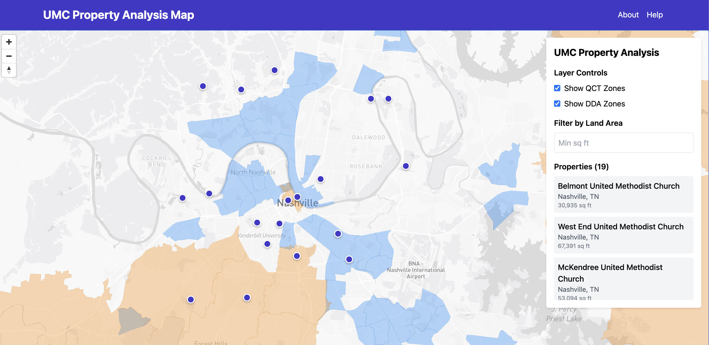

# UMC Property Analysis Map

A web application that overlays Qualified Census Tracts (QCT) and Difficult Development Areas (DDA) with United Methodist Church (UMC) locations, filters properties by land area, and incorporates Low-Mod Income data for market targeting.

## Project Overview

This application helps analyze UMC properties in relation to various federal housing and development designations, providing valuable insights for property development and community investment decisions.




### Key Features

- Interactive map displaying UMC property locations
- Overlay of Qualified Census Tracts (QCT) zones
- Overlay of Difficult Development Areas (DDA) zones
- Property filtering based on land area
- Integration with Low-Mod Income data
- Detailed property information display
- Reliable geocoding with Nashville-area fallback data
- Performance-optimized spatial queries

## Technology Stack

- **Frontend**: React with TypeScript using Vite
- **Styling**: Tailwind CSS
- **Mapping**: Mapbox GL JS via react-map-gl
- **Database**: Supabase (PostgreSQL with PostGIS extension)
- **Deployment**: Vercel/Netlify (planned)

## Getting Started

### Prerequisites

- Node.js (v18 or higher)
- pnpm (v8 or higher)
- Supabase account with database setup
- Mapbox account with API key

### Installation

1. Clone the repository
   ```bash
   git clone <repository-url>
   cd umc-v1
   ```

2. Install dependencies
   ```bash
   pnpm install
   ```

3. Set up environment variables
   ```bash
   cp .env.example .env
   ```
   Then edit the `.env` file with your Supabase and Mapbox credentials.

4. Start the development server
   ```bash
   pnpm dev
   ```

## Key Terms

- **QCT**: Qualified Census Tract - Census tracts designated by HUD where 50% or more of households have incomes below 60% of the Area Median Gross Income
- **DDA**: Difficult Development Area - Areas with high construction, land, and utility costs relative to area median income
- **UMC**: United Methodist Church
- **Low-Mod Income**: Areas with low to moderate income as designated by HUD
- **HUD**: U.S. Department of Housing and Urban Development
- **PostGIS**: Spatial database extension for PostgreSQL that supports geographic objects

## Project Structure

```
├── public/              # Static assets
├── src/                 # Source code
│   ├── assets/          # Images and other assets
│   ├── components/      # React components
│   │   └── Map.tsx      # Main mapping component
│   ├── lib/             # Utility libraries
│   │   └── supabase.ts  # Supabase client and data fetching
│   ├── App.tsx          # Main application component
│   ├── index.css        # Global styles with Tailwind
│   └── main.tsx         # Application entry point
├── .env.example         # Example environment variables
├── package.json         # Project dependencies
├── postcss.config.js    # PostCSS configuration
├── tailwind.config.js   # Tailwind CSS configuration
├── tsconfig.json        # TypeScript configuration
└── vite.config.ts       # Vite configuration
```

## Development Roadmap

See the [PROJECT_TRACKER.md](./docs/PROJECT_TRACKER.md) file for detailed information about the project roadmap and current status.

## Geocoding Implementation

The application includes a robust geocoding solution for UMC locations:

- Hardcoded coordinates for Nashville-area UMC churches provide reliable fallback data
- Location filtering to focus on the Nashville metro area for improved performance
- Property markers are only displayed for locations with valid geocoded coordinates
- SQL functions with spatial filtering to optimize data retrieval

## Performance Considerations

- Supabase queries use bounding box spatial filters to improve performance and prevent timeouts
- Data filtering occurs both in SQL queries and on the client side
- Nashville-centered map view with appropriate zoom level for the metro area
- Minimal external API usage to prevent rate limits

## License

This project is proprietary and confidential.

## Contact

For questions or support, please contact the project maintainers.
